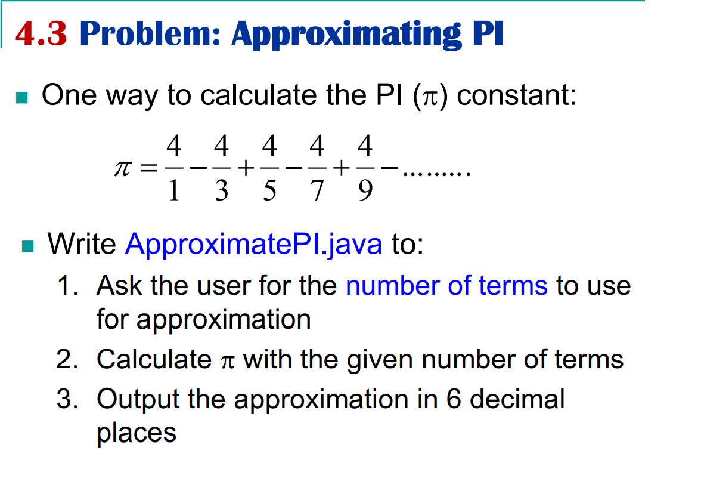

# 1-Intro-to-Java

## Mục lục
1. 
2. 
3. 
4. [Basic Java elements](#basic-java-elements)
    1. None
    2. None
    3.   [Basic Input (Scanner class) and Output](#basic-input-scanner-class-and-output)
            1. [Intro](#intro)
            2. [Input (Scanner class)](#input-scanner-class)
            3. [Output](#output)
            4. [Problem: Approximate PI](#problem-approximate-pi)


## Run cycle


## Basic Input (Scanner class) and Output

### Intro
- Java cung cấp nhiều luồng (streams) khác nhau với I/O package, nhờ đó người dùng có thể thực hiện được tất cả các phép toán nhập xuất. Những luồng này hỗ trợ tất cả các loại đối tượng, kiểu dữ liệu, file,...
- Hãy xem qua 3 luồng tiêu chuẩn hoặc mặc định (**3 standard or default streams**) mà Java cung cấp và được sử dụng phổ biến:
    
    1. `system.in`: Luồng đầu vào tiêu chuẩn (**standard input stream**). Nó cung cấp các dịch vụ để đọc các ký tự từ bàn phím hoặc bất kỳ thiết bị đầu vào tiêu chuẩn nào khác.
    2. `system.out`: Luồng đầu ra tiêu chuẩn (**standard output stream**). Cung cấp các dịch vụ trả về kết quả của một chương trình trên một thiết bị đầu ra như màn hình máy tính.
    3. `system.err`: Luồng lỗi tiêu chuẩn (**standard error stream**). Dùng để xuất tất cả dữ liệu lỗi của một chương trình lên màn hình máy tính hoặc bất kỳ thiết bị đầu ra tiêu chuẩn nào.

**[⬆ về đầu trang](#mục-lục)**

### Input (Scanner class)

  - Để nhập dữ liệu từ bàn phím, cần tạo ra đối tượng thuộc lớp Scanner trong package `java.util.Scanner` (hoặc `import java.util.*`).
  ```java
  import java.util.Scanner;
  ```

* Với đoạn code trên chúng ta có:
    * `java`: package cha
    * `util` : package con của java
    * `Scanner`: là một class chứa trong package util.

* Sử dụng package trong java cho chúng ta rất nhiều lợi ích:
    * Tái sử dụng
    * Cấu trúc đẹp
    * Tránh xung đột tên

- Khởi tạo một đối tượng (**object**) của class Scanner, sau đó chúng ta có thể sử dụng đối tượng để lấy đầu vào từ người dùng bằng các phương thức `nextLong()`, `nextFloat()`, `nextDouble()`, `next()`:
  ```java
  //creat an object of Scanner
  Scanner scVar = new Scanner(System.in)
  // take input from the user
  int number = input.nextInt();
  ```

- Ví dụ:
  
```java
import java.util.Scanner;

public class fahrenheit {
    public static void main(String[] args) {

        double fahrenheit, celsius;

        Scanner sc = new Scanner(System.in);

        System.out.print("Enter temperature in Fahrenheit: ");

        fahrenheit = sc.nextDouble();

        celsius = (5.0/9) * (fahrenheit - 32);
        
        System.out.println("Celsius: " + celsius);
    }
}
```
**Input**
```
Enter temperature in Fahrenheit: 13
```

**Output**
```
Celsius: -10.555555555555555
```


--------------------------
#### Note: 
* Sử dụng phương thức `close()` để đóng đối tưởng `Scanner` sau khi sử dụng 
* Một đối tượng scanner có thể dùng  nhiều lần cho nhiều nguồn đầu vào khác nhau
* Code của bạn sẽ không làm việc nếu bạn sử dụng **nhiều hơn 1 đối tượng `Scanner`**
--------------------------

**[⬆ về đầu trang](#mục-lục)**

* Các method phổ biến của `Scanner`:

|SN	|Modifier & Type|	Method|	Description|
|--------------|:-----:|:------|------:|
|1)|	boolean	|nextBoolean()|	It scans the next token of the input into a boolean value and returns that value.|
|2)|	byte	|nextByte()|	It scans the next token of the input as a byte.|
|3)|	double|	nextDouble()|	It scans the next token of the input as a double.|
|4)|	float|	nextFloat()|	It scans the next token of the input as a float.|
|5)|	int|	nextInt()|	It scans the next token of the input as an Int.|
|6)|	String|	nextLine()|	It is used to get the input string that was skipped of the Scanner object.|
|7)|	String|	next()|	It is used to get the next complete token from the scanner which is in use.|
|8)|	long|	nextLong()|	It scans the next token of the input as a long.|
|9)|	short|	nextShort()|	It scans the next token of the input as a short.|

**[⬆ về đầu trang](#mục-lục)**

* Các method  của `Scanner`:

|SN	|Modifier & Type|	Method|	Description|
|--------------|:-----:|:------|------:|
|1)|	void|	close()|	It is used to close this scanner.|
|2)|	pattern|	delimiter()	|It is used to get the Pattern which the Scanner class is currently using to match delimiters.|
|3)|	Stream<MatchResult>	|findAll()|	It is used to find a stream of match results that match the provided pattern string.|
|4)|	String|	findInLine()|	It is used to find the next occurrence of a pattern constructed from the specified string, ignoring delimiters.
|5)|	string|	findWithinHorizon()|	It is used to find the next occurrence of a pattern constructed from the specified string, ignoring delimiters.
|6)|	boolean	|hasNext()|	It returns true if this scanner has another token in its input.
|7)|	boolean|	hasNextBigDecimal()|	It is used to check if the next token in this scanner's input can be interpreted as a BigDecimal using the nextBigDecimal() method or not.||
|8)|	boolean	|hasNextBigInteger()|	It is used to check if the next token in this scanner's input can be interpreted as a BigDecimal using the nextBigDecimal() method or not.|
|9)|	boolean|	hasNextBoolean()|	It is used to check if the next token in this scanner's input can be interpreted as a Boolean using the nextBoolean() method or not.|
|10)|	boolean|	hasNextByte()|	It is used to check if the next token in this scanner's input can be interpreted as a Byte using the nextBigDecimal() method or not.|
|11)|	boolean	|hasNextDouble()|	It is used to check if the next token in this scanner's input can be interpreted as a BigDecimal using the nextByte() method or not.|
|12)|	boolean|	hasNextFloat()|	It is used to check if the next token in this scanner's input can be interpreted as a Float using the nextFloat() method or not.|
|13)|	boolean|	hasNextInt()|	It is used to check if the next token in this scanner's input can be interpreted as an int using the nextInt() method or not.|
|14)|	boolean|	hasNextLine()|	It is used to check if there is another line in the input of this scanner or not.|
|15)|	boolean	|hasNextLong()|	It is used to check if the next token in this scanner's input can be interpreted as a Long using the nextLong() method or not|.
|16)|	boolean|	hasNextShort()|	It is used to check if the next token in this scanner's input can be interpreted as a Short using the nextShort() method or not.|
|17)|	IOException|	ioException()|	It is used to get the IOException last thrown by this Scanner's readable.|
|18)|	Locale|	locale()|	It is used to get a Locale of the Scanner class.|
|19)	|MatchResult|	match()|	It is used to get the match result of the last scanning operation performed by this scanner.|
|20)|	BigDecimal|	nextBigDecimal()	|It scans the next token of the input as a BigDecimal.|
|21)|	BigInteger|	nextBigInteger()	|It scans the next token of the input as a BigInteger.| 

**[⬆ về đầu trang](#mục-lục)**

## OUTPUT

- Java cung cấp 3 cách cơ bản để xuất kết quả lên màn hình:
    - `System.out.print()`: in ra chuỗi (chỉ có một đối số)
    - `System.out.println()`: in ra chuỗi và đưa con trỏ chuột xuống dòng mới (chỉ có một đối số)
    - `System.out.printf()`: Hỗ trợ format chuỗi (có thể có nhiều đối số)
- Ví dụ về `print()` và `println`:

```java
class Output {
    public static void main(String[] args) {
    	
        System.out.println("1. println ");
        System.out.println("2. println ");
    	
        System.out.print("1. print ");
        System.out.print("2. print");
    }
}
```
**Output:**
```
1. println 
2. println 
1. print 2. print
```

- Về `printf()`:

`System.out.printf( “format-string” [, arg1, arg2, … ] );`

**Format String:**
- Các chỉ định format bao gồm: flag, width, precision, conversion character theo cú pháp sau: 

    `% [flags] [width] [.precision] conversion-character`
    - Flag:
        ```java
        "-" : căn trái ( mặc định là căn phải ) 
        "+" : xuất ra dấu cộng (+) hoặc dấu trừ (-) cho một giá trị số
        "0" : buộc các giá trị số không được đệm (mặc định là đệm trống)
        "," : dấu phân cách nhóm bằng dấu phẩy (cho các số> 1000) 
        " " : hiển thị dấu trừ nếu số âm hoặc dấu cách nếu là số dương
        ```
        **Ví dụ**
        ```java
        public class TestPrintf {
            public static void main(String[] args) {
                 int n= 100000;
                 System.out.printf("Number: %,d%n",n);
            }
        }
        ```

        **Output**
        ```
        Number: 100,000
        ```
    - Width:
        ```
        Chỉ định độ rộng trường để xuất đối số và biểu thị số ký tự tối thiểu được ghi vào đầu ra.
        Bao gồm không gian cho dấu phẩy dự kiến ​​và dấu phẩy thập phân trong việc xác địnhchiều rộng
        cho các giá trị số.
        ```
        **Ví dụ**
        ```java
        public class TestPrintf {
            public static void main(String[] args) {
                 int n= 1000;
                System.out.printf("Number: %10d",n);
            }
        }
        ```

        **Output**
        ```
        Number:       1000
        ```
    - Precision: 
        ```
        Được sử dụng để hạn chế đầu ra tùy thuộc vào chuyển đổi. Nó chỉ định số lượng chữ số của độ 
        chính xác khi xuất giá trị thập phân hoặc độ dài của một chuỗi con để trích xuất từ ​​một Chuỗi. 
        Các số được làm tròn đến độ chính xác được chỉ định.
        ```
         **Ví dụ**
        ```java
        public class TestPrintf {
            public static void main(String[] args) {
                double d= 1.527;
                System.out.printf("Number: %.2f",d);
            }
        }
        ```

        **Output**
        ```
        Number: 1.53
        ```
    - Conversion-Characters:
        ```
        c: Ký tự (C: in hoa ký tự)
        s: Chuỗi (S: in hoa chuỗi)
        d: Số thập phân (số nguyên) (cơ số 10)
        f: Dấu phẩy động
        b: logic (true or false)
        n: xuống dòng (dùng %n thay vì \n để có dộ tương thích cao hơn)
        ```

**[⬆ về đầu trang](#mục-lục)**

## Problem: Approximate PI

 

## Solution: Approximating PI

```java
import java.util.*;

public class ApproximatePI {
    public static void main(String[] args) {
        int nTerms, sign = 1, denom = 1;
        double pi = 0.0;
        Scanner sc = new Scanner(System.in);
        System.out.print("Enter number of terms: ");
        nTerms = sc.nextInt();
        for (int i = 0; i < nTerms; i++) {
            pi += 4.0 / denom * sign;
            sign *= -1;
            denom += 2;
        }
        System.out.printf("PI = %.6f\n", pi);
        sc.close();
    }
}
```

- **Input**
    ```
    Enter number of terms: 100
    ```

- **Output**
    ```
    PI = 3.131593
    ```

**[⬆ về đầu trang](#mục-lục)**
