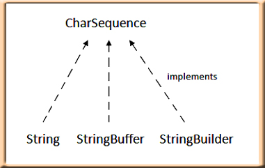
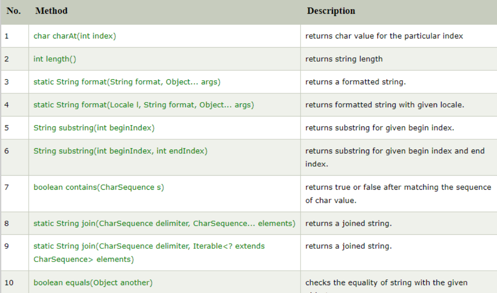
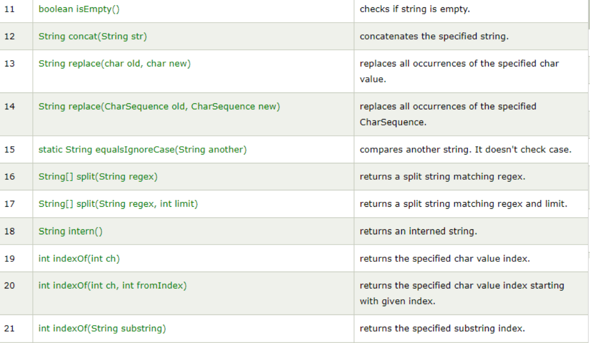
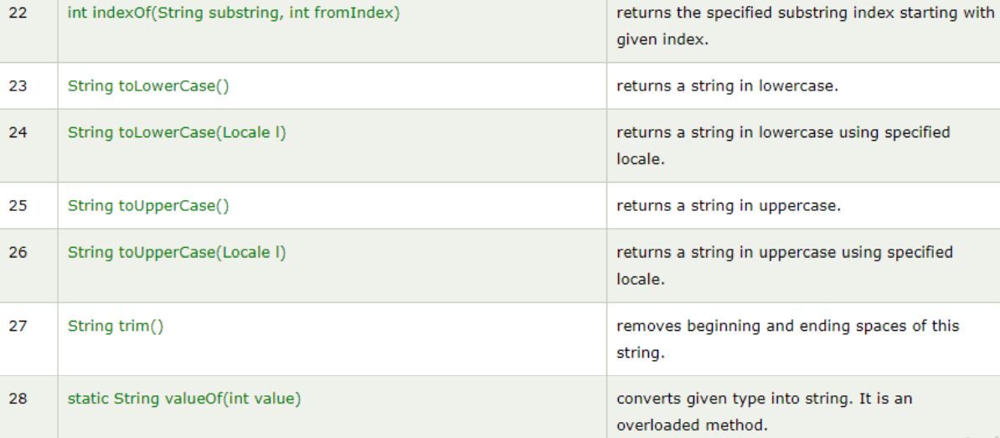

# String In Java

- in Java, a string is a sequence of characters. An array of characters works the same as Java string. For example: `"hello"` is a string containing a sequence of characters `'h'`, `'e'`, `'l'`, `'l'`, and `'o'`.

    - Example:
        ```java
        char chr[] = {'h','l','l','o'};
        String s = new String(chr);
        ```
        is same as:
        ```java
        String s = "hello";
        ```
## CharSequence Interface
- The CharSequence interface is used to represent the sequence of characters. String, StringBuffer and StringBuilder classes implement it. It means, we can create strings in java by using these three classes.

    

- The Java String is immutable which means it cannot be changed. Whenever we change any string, a new instance is created. For mutable strings, you can use StringBuffer and StringBuilder classes.

## Creating a String
- String Literal
    - Java String literal is created by using double quotes. For Example:
        ```java
        String s = "hello";
        ```
    - When we use double quotes to create a String, it first looks for String with the same value in the `String pool`, if found it just returns the reference else it creates a new String in the pool and then returns the reference.  
    => Reused string, make more memory efficient

    - Example:
        ```java
        String s1="Cat";  
        String s2="Cat";
        ```

- Using New Keyword
    - However using new operator, we force String class to create a new String object in heap space. We can use `intern()`method to put it into the pool or refer to another String object from the string pool having the same value

        ```java
        String s3 = new String("Cat");
        ```
 

## String methods
- The java.lang.String class provides many useful methods to perform operations on sequence of char values.





## Demo

```java
public class StringDemo {
    public static void main(String[] args) {

        //creat string
        String s1 = "hello";
        String s2 = "hello";
        String s3 = new String("hello"); 
        char chr []= {' ','w','o','l','d'};
        String s4 = new String(chr); // convert char array to String
        
        //print string
        System.out.println("S1: "+s1);
        System.out.println("S2: "+s2);
        System.out.println("S3: "+s3);
        System.out.println("S4: "+s4);

        //compare string
        System.out.printf("S1 = S2: %b\n",s1 == s2);
        System.out.printf("S1 = S3: %b\n",s1 == s3);
        System.out.printf("S1 equal S3: %b\n",s1.equals(s3));
        

        // CONTAT()
        System.out.println("Contcat:");
        String s = s1.concat(s4);
        System.out.println("s1.concat(s4) = " + s);
        
        //Substring()
        String substr = s.substring(5);
        System.out.println("substr =" + substr);

        // INDEXOF()
        System.out.println();
        System.out.println("IndexOf:");
        String str = "This is text";
        int idx = str.indexOf('i');
        System.out.println("- indexOf('i') = " + idx);
        idx = str.indexOf("te");
        System.out.println("- indexOf(\"te\") = " + idx);

    }
}

```

**Output**
```

S1: hello
S2: hello
S3: hello
S4:  wold
S1 = S2: true
S1 = S3: false
S1 equal S3: true
Contcat:
s1.concat(s4) = hello wold
substr = wold

IndexOf:
- indexOf('i') = 2
- indexOf("te") = 8
```