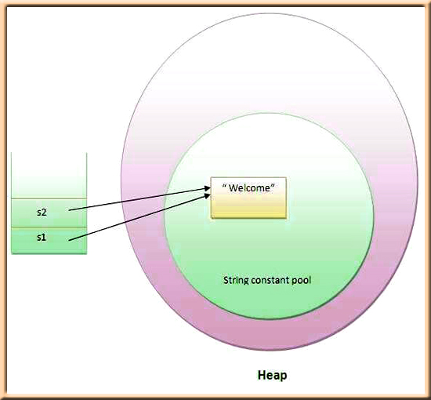

# String In Java

- in Java, a string is a sequence of characters. An array of characters works the same as Java string. For example: `"hello"` is a string containing a sequence of characters `'h'`, `'e'`, `'l'`, `'l'`, and `'o'`.

    - Example:
        ```java
        char chr[] = {'h','l','l','o'};
        String s = new String(chr);
        ```
        is same as:
        ```java
        String s = "hello";
        ```
## CharSequence Interface
- The CharSequence interface is used to represent the sequence of characters. String, StringBuffer and StringBuilder classes implement it. It means, we can create strings in java by using these three classes.

    

- The Java String is immutable which means it cannot be changed. Whenever we change any string, a new instance is created. For mutable strings, you can use StringBuffer and StringBuilder classes.

## Creating a String
- String Literal
    - Java String literal is created by using double quotes. For Example:
        ```java
        String s = "hello";
        ```
    - Each time you create a string literal, the JVM checks the "string constant pool" first. If the string already exists in the pool, a reference to the pooled instance is returned. If the string doesn't exist in the pool, a new string instance is created and placed in the pool.

    - Example:
        ```java
        String s1="Welcome";  
        String s2="Welcome";
        ```
        

        => Reused string, make more memory efficient

- Using New Keyword
    - As we saw above that when we tried to assign the same string object to two different literals, compiler only created one object and made both of the literals to point the same object. To overcome that approach we can create strings like this:

        ```java
        String str1 = new String("Welcome");
        String str2 = new String("Welcome");
        ```

## String methods
- The java.lang.String class provides many useful methods to perform operations on sequence of char values.


## Demo

```java
public class StringDemo {
    public static void main(String[] args) {

        //creat string
        String s1 = "hello";
        String s2 = "hello";

        String s3 = new String("hello"); 

        char chr []= {' ','w','o','l','d'};
        String s4 = new String(chr);
        
        System.out.println("S1: "+s1);
        System.out.println("S2: "+s2);
        System.out.println("S3: "+s3);
        System.out.println("S4: "+s4);

        System.out.printf("S1 = S2: %b\n",s1 == s2);
        System.out.printf("S1 = S3: %b\n",s1 == s3);


        // CONTAT
        System.out.println("Contcat:");

        String s = s1.concat(s4);
        System.out.println("s1.concat(s4) = " + s);
        
        // INDEXOF
        System.out.println();
        System.out.println("IndexOf:");
        String str = "This is text";
   
        int idx = str.indexOf('i');
        System.out.println("- indexOf('i') = " + idx);
     
        idx = str.indexOf("te");
        System.out.println("- indexOf(\"te\") = " + idx);

    }
}
```

**Output**
```
S1: hello
S2: hello
S3: hello
S4:  wold
S1 = S2: true
S1 = S3: false
Contcat:
s1.concat(s4) = hello wold

IndexOf:
- indexOf('i') = 2
- indexOf("te") = 8
```